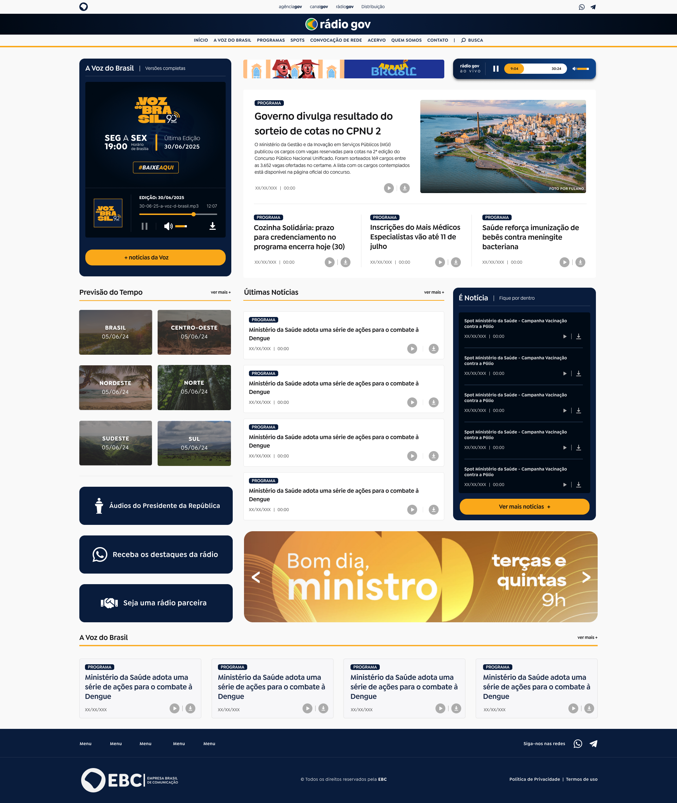
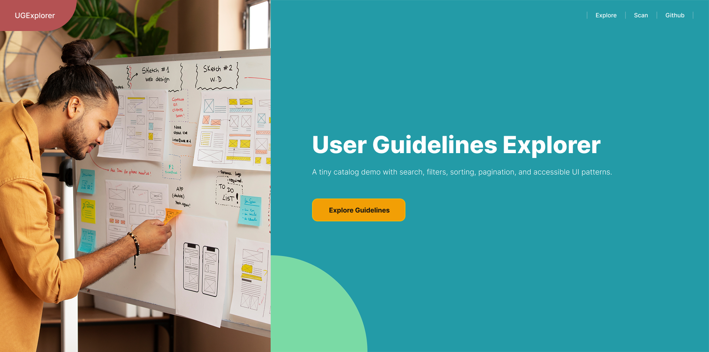

# Lincoln Araujo – UX Engineer & Front-End Developer Portfolio  

---

Welcome to my portfolio repository! 👋  

Here I’ve collected a selection of **real-world projects and demo work** that showcase how I combine **front-end development, UX engineering, and accessibility** into user-centered digital products.  

---

## 👋 About Me  

I’m **Lincoln Araujo**, a **Front-End Developer & UX Engineer** based in Brazil.  

### 🎓 Background  
- **Bachelor’s in Software Engineering** (UNICSUL)
- **Postgraduate in UX Engineering** (PUC Minas)  
- Previous degree in **Japanese Language** (Universidade de Brasília - UNB) 
- Fluent in **Portuguese** (native), **English (B2)**, plus basic **Japanese** and **Spanish**  (for fun)

### 🛠 Skills  
- Front-end development: **React, Next.js, Vue.js, TypeScript, Tailwind, Plone CMS**  
- UX/UI design: **Figma, prototyping, design systems, Adobe Illustrator**  
- Accessibility: **WCAG, semantic HTML, ARIA**  
- Testing: **Vitest, Cypress**  
- Collaboration with designers, editors, and stakeholders to turn complex requirements into usable solutions  

🔗 Connect with me on [LinkedIn](https://www.linkedin.com/in/lincolnaraujo/)

---

## 💡 Note on My Design Process  

Since I often act as both the **designer and developer** on projects, my Figma files are usually more **practical and layout-focused** rather than fully fleshed-out design systems.  
I prioritize turning concepts into working code quickly, ensuring **accessibility and performance**, while still keeping designs consistent and user-friendly.  

---

## 🌐 Featured Projects  

### 1. Agência Gov (Government News Portal)  
Official Brazilian Federal Government news portal, redesigned for accessibility, speed, and usability. I **designed and implemented the frontend end-to-end**.  

- 🌍 [Website](https://agenciagov.ebc.com.br)  
- 🎨 [Figma design](https://www.figma.com/design/TGeswzQ7m1L4wQFX27afpe/Agencia-Gov-2.0?node-id=0-1&t=4Ll4zzGLD9l6HcdS-1)  
- 🖼 Screenshot:  
    

---

### 2. Rádio Gov  
A new platform for distributing government audio content, making national and regional radio more accessible online. I **designed and implemented the frontend end-to-end**.  

- 🌍 [Website](https://radiogov.ebc.com.br)  
- 🎨 [Figma design](https://www.figma.com/design/YsFU9e72tqjfSy8ZQpjYW7/r%C3%A1dio-gov?node-id=679-567&t=4Ll4zzGLD9l6HcdS-1)  
- 🖼 Screenshot:  
    

---

### 3. UX Guidelines Explorer (Demo Project)  
A demo project created during my postgraduate course to practice **Next.js + Tailwind** with accessibility, filtering, pagination, and a mock scanner. I **designed the layouts and coded the app**.  

- 📂 [Repository](https://github.com/Lincoln-Araujo/ux-guidelines-explorer)  
- 🎨 [Figma design](https://www.figma.com/design/CTVrm4cm13PwE2LLFPyXcG/UX-Guidelines-Explorer?node-id=0-1&t=4Ll4zzGLD9l6HcdS-1)  
- 🖼 Screenshot:  
    

---

## 🔎 Explore More  

I also work on side projects, experiments, and contributions around UX, accessibility, and front-end development.  
👉 Check out more of my work here: [github.com/Lincoln-Araujo](https://github.com/Lincoln-Araujo?tab=repositories)

---

✨ This portfolio highlights how I combine **front-end engineering skills** with a **UX mindset** to deliver accessible, user-centered digital products.  
